# INFINITE

### Founder of INFINITE LABS

I build and experiment with **VPS, servers, hosting, Linux and automation**.

I'm a fast learner who enjoys understanding new technologies, experimenting with them, and turning what I learn into useful projects.

  
  
  

📧 **infiniteispro8@gmail.com**

---

## 📊 GitHub Stats

---

## 🛠️ Tech Stack

---

## 🚀 What I Do

- 🖥️ VPS & Server Management
- ☁️ Hosting & Cloud Infrastructure
- 🐧 Linux & System Administration
- ⚙️ Server Automation
- 🤖 Bots & Developer Tools
- 🌐 Self-Hosted Projects
- 🎬 Technical Content & Tutorials

---

## 🐍 Contribution Snake

---

## ⚡ Learning & Building

I learn new technologies quickly and like to understand **how things work**, not just how to use them.

When I find something new, I experiment with it, break it, understand it, and build something useful with it.

---

### INFINITE LABS

**VPS • Servers • Hosting • Linux • Automation**

Thanks for visiting my profile.

